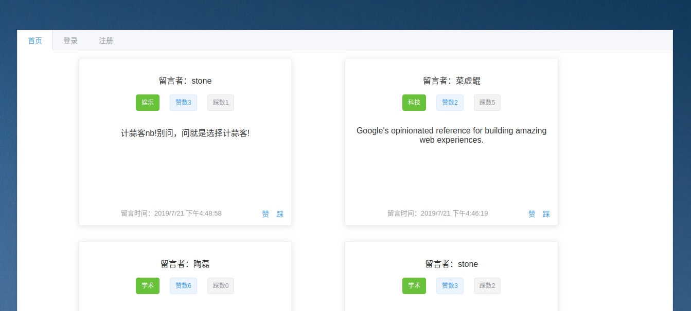

# 项目名称
> 留言板
> 作者：陶磊
> 邮箱：stonebegin@sina.com

# 技术栈
 Django + DRF + Vuejs + Element + MySQL

# 运行方式
此目录下运行
```
1.先 cd 到 ./src/frontend/ 下
运行 npm install 命令安装前端相关依赖
2.返回到与本README.MD同级的目录下
运行 docker-compose up 命令，启动前后端服务器
(如果运行有问题，可能是后端缺少相关依赖，请 cd 到 /src/backend/下 pip install安装缺少的依赖)
3.在浏览器中访问 http://frontend.docker.io 访问相关服务
```
# 目录结构
###### 后端相关
```
后端项目名称api(不是我起的)，分为board、user两个应用
/src/backend/board/ 下实现留言板留言、点赞、踩等功能
/src/backend/user/ 下实现登录注册相关功能
```
###### 前端相关
```
主要分为Index(首页)、Board（留言板）、Login（登录）、Signup（注册）四个组件
实现了注册，登录，登出，留言，点赞，踩等功能
输入邮箱密码用户名有相关验证，留言增加了分类功能
```
***

# 运行预览



